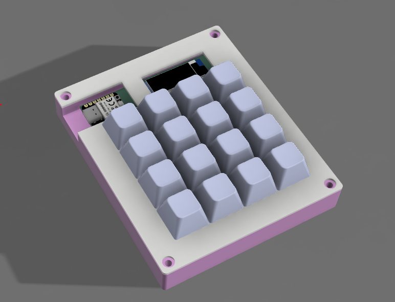
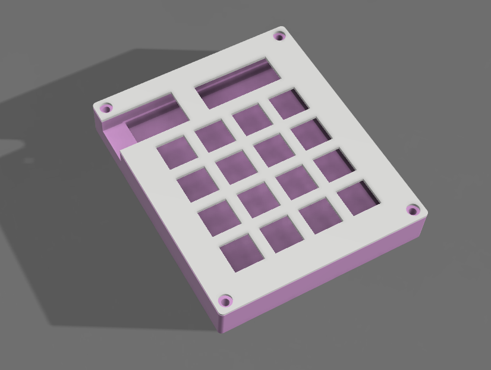
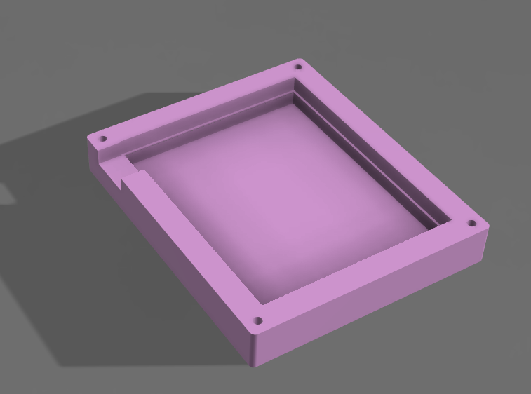
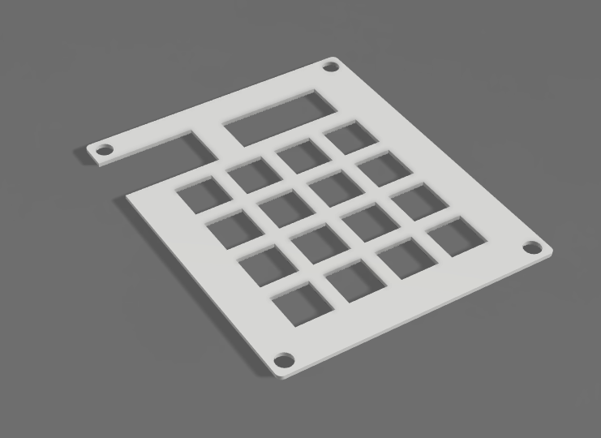
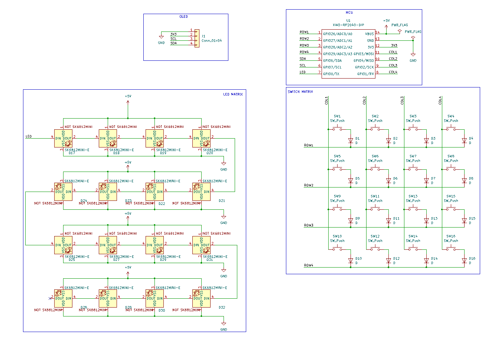
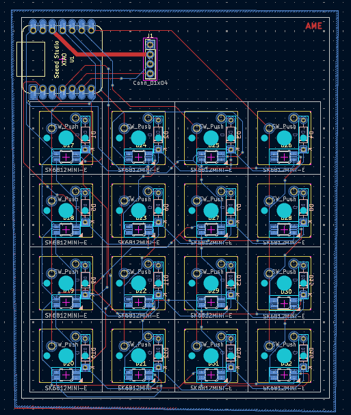
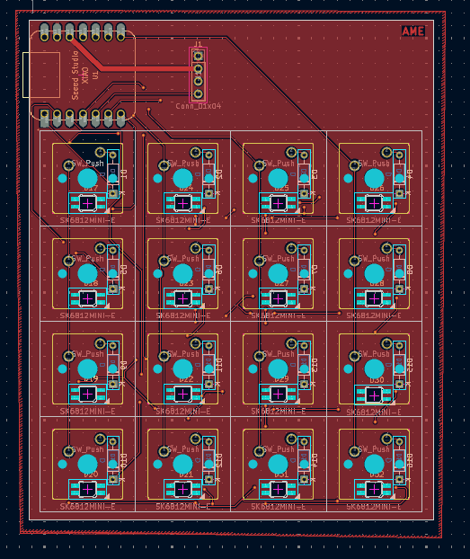
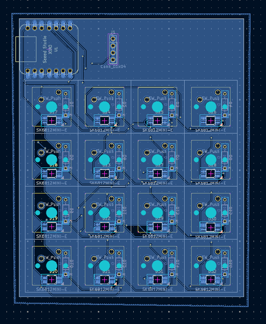

<h1> Amethyst Hackpad  </h1>
Welcome to my project.  
Its a cutie made my be :)  
with amethyst colors as my name  

<h2> Design  </h2>
Below are all the images of hackpad  

  

Case :-  
  

Bottom layer :-  
  
For the pcb to rest on i have added a small ridge ( with chamfer on the below )  

Top layer :-  
  

<h2> Electronics </h2>  

Now let's get to the electronics part!  
Schematics ( Made in KiCad ) :-  

  

PCB :-  

  
  
  

<h2> Bill of Materials  </h2>
And finally here is the all the materials I used :-  

|      |Component Used            |      |Quantity|
|------|--------------------------|------|--------|
|      |                          |      |        |
|1     |Seeed XIAO RP2040         |      |1       |
|      |                          |      |        |
|2     |MX-Style switches         |      |16      |
|      |                          |      |        |
|3     |Through-hole 1N4148 Diodes|      |16      |
|      |                          |      |        |
|4     |0.91 inch OLED            |      |1       |
|      |                          |      |        |
|5     |Blank DSA keycaps         |      |16      |
|      |                          |      |        |
|6     |SK6812 MINI-E LEDs        |      |16      |
